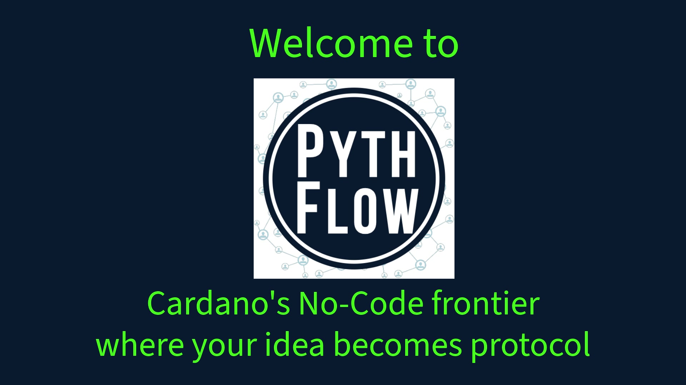

# PythFLOW

**Cardano’s no-code frontier — where your idea becomes protocol.**

PythFLOW is a visual builder for oracle-aware flows on Cardano: compose pipelines from nodes, connect Pyth price data, and pair off-chain logic with on-chain contracts (Aiken + MeshJS). This repository hosts **Pyth integration examples** and the **PythFLOW** Cardano demo stack.

---

## Pitch poster

*High-resolution poster: [`public/iron-pig-pitch-poster.jpg`](public/iron-pig-pitch-poster.jpg)*

---

## Litepaper

**[PythFLOW Litepaper (English PDF)](public/PythFLOW_Litepaper_EN.pdf)**

---

## Team

- **Santiago Amaya**
- **Lisandro Fause**
- **Juan Garcia Carballo**
- **Luciano Bianco**
- **Facundo Couto**

---

## Repository contents

This monorepo contains **examples of applications integrating Pyth products and services** across chains and stacks. Explore subfolders for chain-specific demos (EVM, Solana, Cardano / Lazer, etc.).

---

## Brand palette

Inspired by the pitch poster: **navy blue** background, **white** and **neon green** accents.
