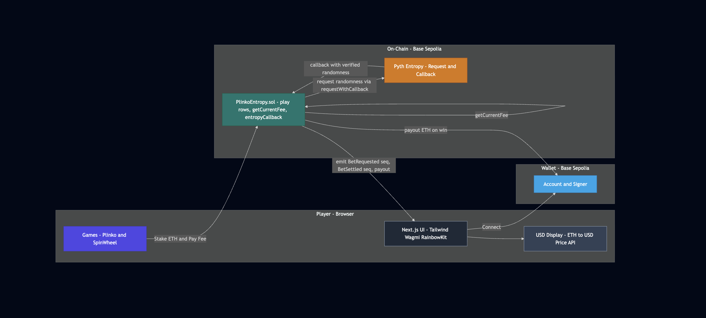
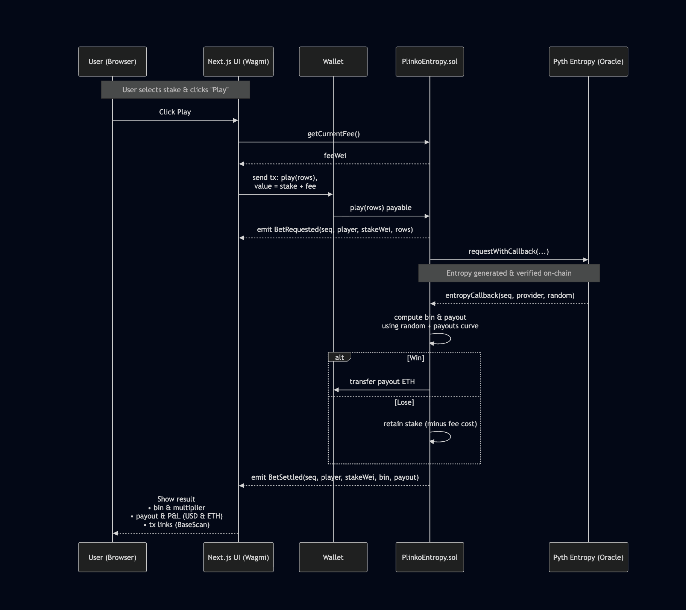

# Entropy Arcade – Provably Fair On-Chain Games Using Pyth Entropy

Demo: [https://www.youtube.com/watch?v=Q15hgZXPQOo](https://www.youtube.com/watch?v=Q15hgZXPQOo)
Source Code: [https://github.com/PranavPipariya/yellow-lane](https://github.com/PranavPipariya/yellow-lane)

---
## Overview

**Entropy Arcade** is an on-chain arcade platform built on **Base Sepolia**, powered by **Pyth Entropy** for provably random and verifiable gameplay outcomes.
It demonstrates how decentralized, tamper-proof randomness can power fair staking-based games in Web3.

The platform includes several games:
- **Plinko** – the primary game demonstrating full Pyth entropy integration
- **Spin Wheel** – wheel-of-fortune-style multiplier game
- **Mines** – strategic risk-reward game
- **Poker** – prototype for future multi-player randomness applications

Every result is driven by **Pyth Entropy**, ensuring transparent, fair outcomes directly verifiable on-chain.

---

## Key Features

- On-chain randomness from **Pyth Entropy**
- Built on **Base Sepolia testnet**
- Smart contracts written in **Solidity** (Hardhat)
- Frontend powered by **Next.js 15**, **Tailwind CSS**, **Wagmi**, and **RainbowKit**
- Full ETH + USD balance display for clarity
- Modular architecture supporting multiple games
- Public deployment and interaction scripts for reproduction

---

## Architecture




### Flow Summary

1. Player connects a wallet and deposits Base Sepolia ETH.
2. When a game is played, the contract requests randomness from **Pyth Entropy**.
3. The **Entropy Provider** returns the random value via a callback.
4. The contract computes the outcome (Plinko slot, SpinWheel sector, etc.).
5. ETH payouts are sent to the player based on the random result.

---

## Smart Contract

### `PlinkoEntropy.sol`

Implements the complete Plinko lifecycle:
- `play()` — user stakes ETH and triggers a Pyth Entropy request
- `entropyCallback()` — receives verified random bytes and resolves results
- Determines multiplier and payout using on-chain randomness
- Handles reward distribution to the player

**Deployed Contract (Base Sepolia):**
[`0x78498F041Aa2841Ea4C266dc0E1D9Df32B6E468a`](https://sepolia.basescan.org/address/0x78498F041Aa2841Ea4C266dc0E1D9Df32B6E468a)

**Entropy Provider:**
`0x6CC14824Ea2918f5De5C2f75A9Da968ad4BD6344`

---

## Randomness Workflow

1. A player calls `play()` with a stake and entropy fee.
2. Contract calls `requestWithCallback()` from Pyth Entropy.
3. Pyth Entropy returns verified random bytes through `entropyCallback()`.
4. Contract derives a final outcome from the entropy result.
5. Payout or loss is recorded and executed on-chain.

---

## Project Structure
```
yellow-lane/
├── contracts/
│   ├── PlinkoEntropy.sol
│   └── EntropyArcadeV1.sol
├── scripts/
│   ├── deploy.ts
│   ├── deploy_arcade.ts
│   ├── fund.ts
│   ├── arcade_fund.ts
│   └── balance.ts
├── src/
│   ├── app/games/
│   │   ├── plinko/
│   │   ├── spinwheel/
│   │   ├── mines/
│   │   └── poker/
│   ├── components/games/
│   │   ├── Plinko.tsx
│   │   ├── SpinWheel.tsx
│   │   ├── Mines.tsx
│   │   └── PokerGame.tsx
│   ├── lib/contracts.ts
│   └── lib/wagmi.ts
├── public/
│   ├── sys.png
│   ├── play.png
├── hardhat.config.cjs
├── package.json
└── README.md
```

---

## Setup and Deployment

### Requirements
- Node.js (≥ 18)
- PNPM
- Hardhat
- Base Sepolia wallet funded with test ETH
- Faucet: [https://faucet.base.org](https://faucet.base.org)

---

### 1. Clone and Install
```bash
git clone https://github.com/PranavPipariya/yellow-lane
cd yellow-lane
pnpm install
```

---

### 2. Environment Variables

Create a `.env` file in the root directory:
```bash
PRIVATE_KEY=your_wallet_private_key
BASE_SEPOLIA_RPC_URL=https://sepolia.base.org
```

Ensure your wallet has sufficient Base Sepolia ETH for deployment and entropy fees.

---

### 3. Compile and Deploy Contracts
```bash
pnpm hardhat compile
pnpm hardhat run scripts/deploy.ts --network baseSepolia
```

Deployment will output your contract address and linked entropy provider.

---

### 4. Launch Frontend
```bash
pnpm dev
```

Then visit [http://localhost:3000](http://localhost:3000).
Connect your wallet and navigate to `/games/plinko` to test the main game.

---

## Demo and Repository

* **Demo Video:** [https://www.youtube.com/watch?v=Q15hgZXPQOo](https://www.youtube.com/watch?v=Q15hgZXPQOo)
* **Source Code:** [https://github.com/PranavPipariya/yellow-lane](https://github.com/PranavPipariya/yellow-lane)

The demo features **Plinko**, showing full Pyth entropy integration.
Additional games (Spin Wheel, Mines, Poker) are implemented within the same codebase and architecture.

---

## Technical Stack

| Layer              | Technology               |
| ------------------ | ------------------------ |
| Smart Contracts    | Solidity (Hardhat)       |
| Randomness         | Pyth Entropy             |
| Blockchain         | Base Sepolia Testnet     |
| Frontend           | Next.js 15, Tailwind CSS |
| Wallet Integration | Wagmi, RainbowKit        |
| Utilities          | Ethers.js v6, TypeScript |

---

## Future Development

### Contract Architecture Enhancement
Currently, all games utilize the `PlinkoEntropy.sol` contract for demonstration purposes, which may result in entropy callbacks taking 2-3 minutes for non-Plinko games as the contract is optimized for Plinko's specific mechanics. Each game is designed to eventually have its own optimized contract for improved performance.

**In Progress**:
- `EntropyArcadeV1.sol` – A generalized arcade contract architecture is already developed (see `/contracts`)
- Game-specific contracts with tailored multiplier logic, payout structures, and callback handling
- Optimized gas efficiency and response times per game type

**Roadmap**:
- [ ] Deploy dedicated contracts for Spin Wheel, Mines, and Poker
- [ ] Implement multi-player support for Poker with entropy-based card dealing
- [ ] Enhanced game state management and history tracking
- [ ] Mainnet deployment on Base
- [ ] Smart contract security audit

The current implementation demonstrates the core concept: **provably fair on-chain randomness via Pyth Entropy**.

---

## Evaluation Alignment

This project satisfies all **Pyth Entropy Pool Prize** requirements:

* Demonstrates verifiable on-chain randomness consumption through **Pyth Entropy**
* Links randomness to tangible, stake-based game outcomes
* Provides open-source contracts, reproducible setup, and full documentation
* Includes architecture diagrams and a recorded live demo
* Demonstrates extensibility for additional game types using the same entropy framework

---

## Acknowledgments

Developed by **Pranav Pipariya**
Submission for the **Pyth Entropy Pool Prize Track**
