<div align="center">


# 🏛️ JuryDAO
### Decentralized Governance Through Random Jury Selection

[](https://soliditylang.org)
[](https://react.dev)
[](https://book.getfoundry.sh)
[](https://entropy.pyth.network)
[](LICENSE)

**[🚀 Quick Start](#installation) • [📖 Features](#-features) • [🎮 Usage](#-usage-guide) • [🧪 Tests](#-testing)**

A solo Web3 project by a developer from IIT Roorkee 🇮🇳
</div>

---

## 🎯 What is JuryDAO?
JuryDAO is a decentralized governance framework that replaces all-hands voting with provably random juries per proposal, improving fairness, participation, and efficiency. It uses verifiable randomness (VRF) to select a small jury for each proposal, compensates voters for gas, and finalizes outcomes transparently. The design combats whale dominance, reduces voter fatigue, and makes governance more reliable and scalable.

### The Problem
- Whale dominance: large token holders control outcomes
- Low participation: most members don't vote consistently
- Time cost: reviewing every proposal is exhausting

### The Solution
- Random juries per proposal (equal selection chance)
- Verifiable randomness via Pyth Entropy VRF
- Gas refunds for jurors to encourage participation
- Automatic callbacks to progress proposals reliably

---

## 🖼️ Screenshots
<div align="center">

### 🏠 Home

Landing with clear CTAs and project overview.

### 📊 Dashboard

Track proposals, states, juror slots, and timelines.

### ✍️ Create Proposal

Proposers set title, details, jury size, and deadlines.

### 👨‍⚖️ Juror Registration

Register eligibility (e.g., 100 DGOV requirement).

### ⚙️ Admin Panel

Manage fees, funds, and system parameters.

### 📜 Proposal Details

Selected jurors vote; results shown in real time.

</div>

---

## ✨ Features

### 🔮 Smart Contracts
- Provably random jury selection via Pyth Entropy VRF
- Automatic selection callbacks within ~60 seconds
- Gas refunds to voters (e.g., 0.0005 ETH per vote)
- Flexible voting periods (1 hour to 30 days)
- Fisher–Yates shuffle for unbiased selection
- Owner-controlled fee management and safe withdrawals

### 🎨 Frontend
- Wallet integration (e.g., MetaMask) and network checks
- Real-time state updates and explorer links
- Responsive UI with animations and toasts
- Clear flows for proposers, jurors, and admins

---

## 🏗️ Tech Stack

| Category          | Technology                      |
|-------------------|----------------------------------|
| Smart Contracts   | Solidity 0.8.20, Foundry         |
| Randomness        | Pyth Network Entropy             |
| Frontend          | React 18, Vite, TypeScript       |
| Styling           | Tailwind CSS, Framer Motion      |
| Web3              | Ethers.js v6                     |
| Network           | Base Sepolia (Testnet)           |

---

## 📦 Installation

### Prerequisites
- Node.js v18+ and npm
- Foundry (forge, cast, anvil)

Check versions:
```bash
node --version
forge --version
```

Install Foundry:
```bash
curl -L https://foundry.paradigm.xyz | bash
foundryup
```

### Clone
```bash
git clone https://github.com/yourusername/jurydao.git
cd jurydao
```

### Install Dependencies
```bash
npm install
forge install
```

### Environment Setup
Create a `.env` in project root:
```ini
# Private key (0x-prefixed); DO NOT COMMIT THIS FILE
PRIVATE_KEY=0xYOUR_PRIVATE_KEY

# Base Sepolia RPC
RPC_URL=https://sepolia.base.org

# Basescan API key (for contract verification)
ETHERSCAN_API_KEY=YOUR_BASESCAN_KEY

# Pyth Entropy (Base Sepolia)
ENTROPY_ADDRESS=0x41c9e39574F40Ad34c79f1C99B66A45eFB830d4c
ENTROPY_PROVIDER=0x6CC14824Ea2918f5De5C2f75A9Da968ad4BD6344

# Frontend-populated by deploy script (fill after deploy)
VITE_GOVERNANCE_TOKEN=
VITE_JUROR_REGISTRY=
VITE_GOVERNOR_SORTITION=
```

---

## 🚀 Deployment

### Contracts
If you have a helper script:
```bash
chmod +x redeploy.sh
./redeploy.sh
```
The script should:
1. Compile contracts
2. Deploy to Base Sepolia
3. Verify on Basescan
4. Write deployed addresses into `.env`

### Frontend
```bash
npm run dev
```
Open http://localhost:5173

---

## 📚 Architecture

### Flow (Mermaid)

```mermaid
graph TD
  A[User Creates Proposal] --> B[Pay BASE_FEE × MULTIPLIER]
  B --> C[Request Pyth Entropy]
  C --> D[Pyth Generates Random Number]
  D --> E[entropyCallback Triggered]
  E --> F[Fisher–Yates Shuffle]
  F --> G[Jury Selected]
  G --> H[Proposal Active]
  H --> I[Selected Jurors Vote]
  I --> J[Proposal Executed]
```


### Core Interfaces (example)
```solidity
// Create a proposal with ETH fee
function createProposal(
  string memory title,
  string memory description,
  uint256 jurySize,
  uint256 votingPeriodSeconds
) external payable;

// Pyth Entropy callback (internal)
function entropyCallback(
  uint64 sequenceNumber,
  address provider,
  bytes32 randomNumber
) internal;

// Vote (jurors only) with gas refund
function vote(uint256 id, bool support) external;

// Finalize after the end time
function execute(uint256 id) external;
```

### Fee Model (example)
- Total cost ≈ (BASE_FEE × MULTIPLIER) + (jurySize × GAS_REFUND)
- Example (5 jurors): (0.01 × 3) + (5 × 0.0005) = 0.0325 ETH

---

## 🎮 Usage Guide

### Juror
1. Register eligibility (meets token threshold, e.g., 100 DGOV)
2. If selected, open the proposal page
3. Cast vote and receive gas refund

### Proposer
1. Create proposal with title, description, jury size, deadline
2. Pay required ETH; wait for automatic jury selection
3. Monitor votes and finalize after end time

---

## 🧪 Testing
```bash
forge test -vvv
forge test --match-contract GovernorSortitionTest -vvv
forge test --gas-report
forge coverage
```

---

## 🐛 Troubleshooting

- "Insufficient funds" on deploy or callback  
  Use a Base Sepolia faucet to top up test ETH.

- "Jury not selected" after creation  
  Check the Pyth Entropy explorer for request/callback status and ensure fee multiplier covered callback gas.

- Wallet not connecting  
  Add Base Sepolia network:
    - RPC: https://sepolia.base.org
    - Chain ID: 84532
    - Explorer: https://sepolia.basescan.org

---

## 📈 Roadmap
- [x] Core governance (propose, select jury, vote, execute)
- [x] Pyth Entropy integration
- [x] Gas-optimized contracts
- [x] Responsive animated UI
- [ ] Proposal delegation
- [ ] Multi-chain deployments
- [ ] Decentralized storage for proposals (IPFS)
- [ ] Analytics dashboard
- [ ] Mobile app

---

## 🤝 Contributing
1. Fork the repo
2. Create a branch: `git checkout -b feature/awesome`
3. Commit: `git commit -m "feat: add awesome thing"`
4. Push: `git push origin feature/awesome`
5. Open a Pull Request

---

## 📄 License
MIT — see [LICENSE](./LICENSE)

---

## 🙏 Acknowledgments
- Pyth Network — verifiable randomness and tooling
- Foundry — smart contract toolchain
- Base — affordable L2 infrastructure
- OpenZeppelin — security standards

---

## 📞 Contact
- GitHub: @Samarth208P
- Twitter: @SamPy4X
- Email: samarth208p@gmail.com

<div align="center">

### ⭐ If you like this project, consider giving it a star!
Made with ❤️ and ☕  
**[⬆ Back to Top](#-jurydao)**

</div>