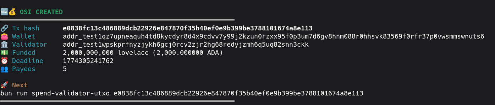
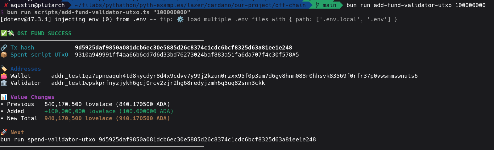
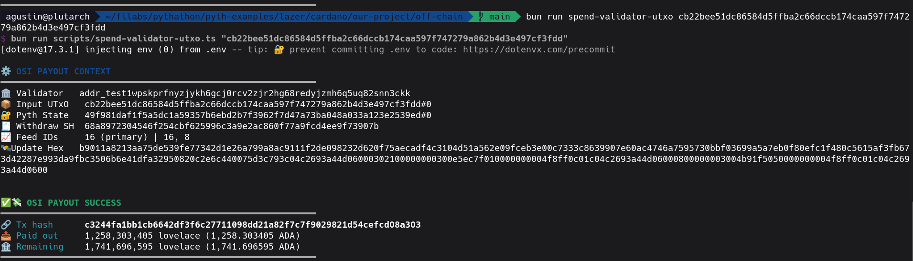
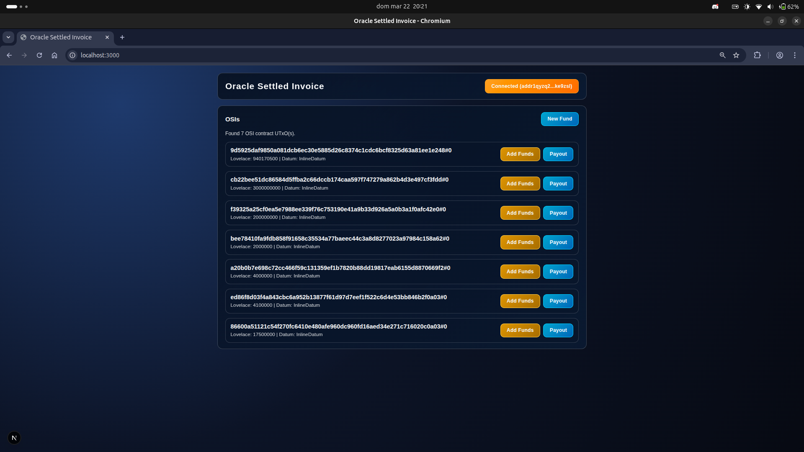

# OSI: Oracle-Settled Invoice

Oracle-Settled Invoice is a Cardano escrow that locks one asset and settles a liability indexed to another using Pyth prices.

This project is a practical blueprint for building oracle-driven settlement flows on Cardano with Pyth. It combines Aiken on-chain validators with a typeScript off-chain client, so you can go from contract logic to real transaction execution with minimal setup.

## Sections

- [Introduction](../OSI/README.md#introduction)
- [Project structure](../OSI/README.md#project-structure)
- [Setup](../OSI/README.md#setup)
- [Running instructions](../OSI/README.md#running-instructions)
    - [CLI](../OSI/README.md#1-run-the-cli)
    - [Web page](../OSI/README.md#2-run-the-webpage)

## Introduction

This project addresses a common payments challenge: obligations are often defined in one currency, while treasury and disbursement happen in another. In OSI (Oracle-Settled Invoice), the payable amount is denominated in a quote asset (USDT in this PoC), but settlement is executed in ADA using real-time oracle conversion.

For this proof-of-concept, we use the USDT/USD and ADA/USD feeds. At settlement time, the transaction consumes signed Pyth price updates and computes the ADA amount required to satisfy each USDT-denominated payout. This enables deterministic and transparent cross-currency settlement directly on-chain.

The `off-chain` component in OSI/off-chain/e2e.ts uses Pyth’s SDK to fetch signed price updates and Evolution SDK to construct the transaction. The `on-chain` validator in OSI/on-chain/validators/osi.ak, using Pyth’s Aiken library, verifies those updates at execution time (including authenticity and timing) before allowing payout. This ensures the ADA delivered matches the expected USDT value according to trusted oracle data, reducing exchange-rate dispute risk between payer and payee.

The same pattern can support many real use cases, such as:

- payroll where compensation is defined in USD but paid in ADA;
- vendor invoices denominated in fiat and settled in crypto;
- scheduled future payments indexed to a CNT pegged to an RWA, while settlement occurs in another on-chain asset.

## Project structure

```bash
lazer/cardano/OSI/
├── on-chain/
├── off-chain/
├── web-ui/
└── README.md
```

- `on-chain`: smart contract implementation
- `off-chain`: transaction building and connection with Pyth
- `web-ui`: dApp connection with browser wallet (Eternl recommended)
- `README.md`: project explanation and running instructions

## Setup

### 1. Build contracts

```bash
cd on-chain
aiken build
```

### 2. Set environment variables

Create a `.env` file in the `off-chain` directory with the following variables:

- `LAZER_TOKEN` - The token that provides access to the Pyth API.
- `NETWORK` - Cardano network (recommended `preprod`)
- `PROVIDER_TYPE` - Cardano provider (recommended Blockfrost)
- `BLOCKFROST_BASE_URL` - The base URL for the Blockfrost API. For preprod, this is `https://cardano-preprod.blockfrost.io/api/v0`.
- `BLOCKFROST_PROJECT_ID` - Your Blockfrost project ID for the preprod network.
- `WALLET_MNEMONIC` - The mnemonic phrase for the wallet that will be used to interact with the contracts. This wallet should have some ADA on the preprod network.
- `PYTH_POLICY_ID` - The policy ID of the Pyth on the Cardano preprod network.

### 3. Install off-chain deps

```bash
cd off-chain
bun install
```

## Running instructions

There are two ways to interact with the dApp:

### 1. Run the CLI

The CLI allows the creation and payout of the escrows.

#### 1.1 Start the escrow

Creates an UTxO allocating minAda and including the list of payees in the datum

```bash
bun run create-validator-utxo
```



#### 1.2 Fund the escrow

Adds the funds to pay out later

```bash
bun run add-fund-validator-utxo <AMOUNT>
```



#### 1.3 Pay out

Pays out the expected amount of ADA to the payees specified in the datum

```bash
bun run spend-validator-utxo <HASH>
```



### 2. [Experimental] Run the webpage

Lift a webpage that will be available on `localhost:3000`.

```bash
cd web-ui
bun install
bun run dev
```



The web implementation can be accessed on [this branch](https://github.com/lolaaimar/pyth-examples/tree/integration).