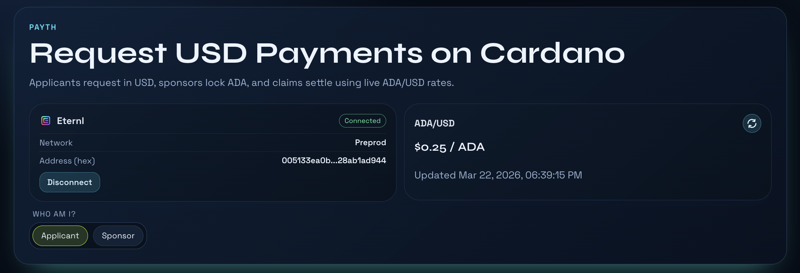
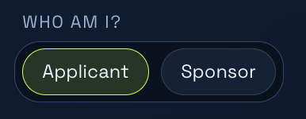
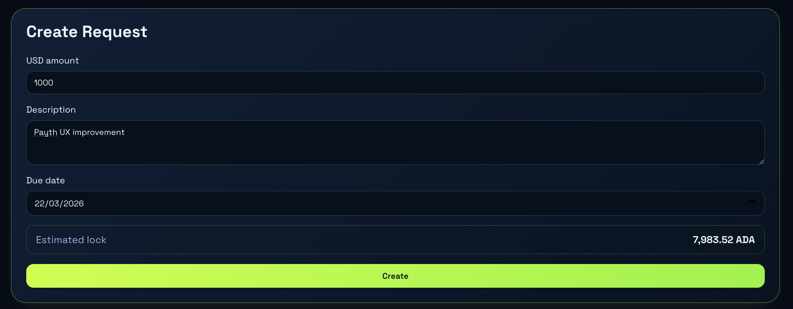
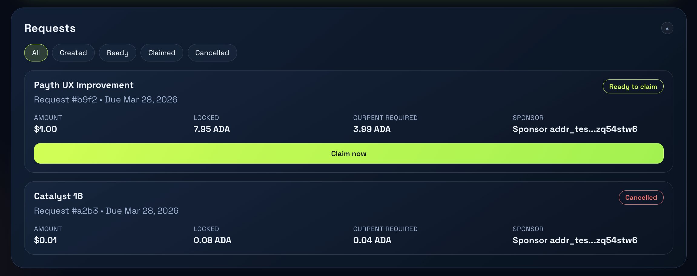

# Payth: calibrate uncertainty

This project aims to bring Pyth to Cardano with a simple, small and yet useful use case. Right now it's not a product per se, but it could become one in some ways. 

## Project description

Imagine you want to submit a grant proposal for a project idea you had that will improve Cardano significantly. You do your research, desing a feasible solution, and estimate a budget based on the amount of time and effort you expect to put on the solution. But, the grant will be paid in *ADA*, while your budget is estimated in *USD*.

Of course, you could convert the budget to ADA using the current exchange rate, but delivery may take months or even years. During that time, the rate can fluctuate dramatically, potentially reaching entirely different value ranges. Payth solves this problem.

The idea is pretty basic: an applicant, Anne, wants to do some task that will be paid in the future by some sponsor Bill. The transaction is gonna be in ADA, but Anne wants the price fixed in USD to avoid possible fluctuations. This could be benefitial, economically speaking, to any of them depending on the market. So Anne fixes a price in USD and, using the off-chain Pyth API, determines the corresponding amount of ADA at the given moment. She makes a request to Bill, and he **locks** in a Cardano Validator that amount of ADA, plus a certain margin (right now that margin is fixed to 100%).

When both actors agree the task is complete, Bill proceeds to **unlock** the funds. How much? Well, the amount of ADA corresponding to the USD agreed, but using the current relation between USD and ADA. This is where **Pyth** comes in to compute on-chain how much ADA should be sent to Anne and how much should return to Bill. 

In the case that Anne leaves the job undone, or any real life condition that interrupts the relationship, Bill has the option to retrieve the locked funds. So, in summary, there are 2 possible flows: **lock --> unlock** and **lock --> cancel**. 

This of course can improve in many ways:
* Add validity times for the unlock or the cancel actions
* Give flexibility to the margin given by Bill
* Allow other currencies to be used instead of USD

## Use cases
Catalyst and other rounds of funding could optionally use this system to reduce uncertainty for developers, but also it could work for freelance initiatives, service retainers and bounties or open tasks.

## Codebase overview
The project is divided into 2 main sections: backend and frontend. 
* The **frontend** connects the user with their Eternl wallet and makes requests to Pyth off-chain API to track the current ADA and USD value in the market. It also handles user interactions and request to the backend for creating a Task, completing a Task and retrieving money if the task is aborted. It is divided in 2 screens "Applicant" and "Sponsor" where each role has a different view. 
* The **backend** provides 3 endpoints for the 3 actions, which in this context correspond to **lock**, **unlock** and **cancel** scripts. Each of them handles the deploy of a different transaction in cardano, using the **Evolution** framework. It also contains the Aiken code that will regulate the **unlocking** of funds. It also contains a battery of Aiken and Typescript tests. 

## Try it yourself
* Go to the ```frontend``` directory, run ```npm i``` and run the frontend with ```npm run dev```.
* Go to the ```backend``` directory, run ```npm i``` and run the server with ```npm run api```.
* Go to the ```backend``` directory, create a ```.env``` file like the `.env.example` and fill it with your own credentials. Give funds to the sponsor address.
* Go to the ```frontend``` directory, create a ```.env``` file like the `.env.example` and fill it with your own credentials.
* To run the tests, run `aiken check` for the Aiken tests and `npm run test` for the backend tests.

**Disclaimer:** some actions may take more than one attempt or take some time to make impact, sorry for the complications.

Note that the project must be run in Google Chrome, or any browser that supports Eternl Wallet extension (but it was tested in Chrome).  

## Frontend overview
Here you can see the header of the page after connecting the wallet



Then you can choose which role are you on:



If you are an applicant, you can create your request



and then see a list of created requests

