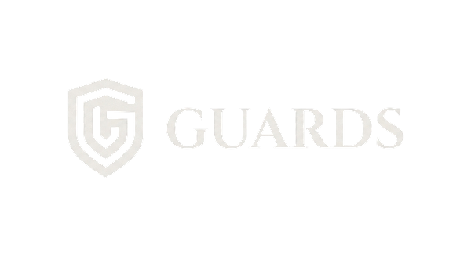

<p align="center">
  
</p>

<p align="center"><strong>Oracle-aware treasury policy enforcement for multichain DAOs.</strong></p>

<p align="center">
  <code>guards.one</code> is a treasury control plane that ingests real-time oracle data, evaluates risk against configurable policy rules, and executes protective swaps automatically, auditably, and across chains.
</p>

---

## The Problem

DAOs and on-chain treasuries usually define treasury mandates in percentages, but the real failure mode is breaching an absolute fiat-denominated floor. When markets move fast, manual multisig coordination is too slow to protect value.

Most treasury tooling either tracks prices passively or requires human intervention at every step. Neither approach is enough when the goal is to defend a hard protection floor under volatile conditions.

## How Guards Solves It

Guards turns treasury risk rules into executable actions:

1. Ingest oracle snapshots from Pyth
2. Evaluate treasury health using drawdown, liquid value, confidence, and freshness
3. Authorize a bounded execution intent with oracle evidence
4. Execute an approved route from a capped hot wallet
5. Anchor an audit trail with intent, result, and oracle context

## Implemented MVP Scope

The current repository already includes:
- a shared core policy engine with liquid-value based triggers using `price`, `emaPrice`, `confidence`, freshness, and fiat floors
- a Cardano control-plane simulator plus an `Aiken` scaffold for the on-chain port
- backend services for collector, keeper, risk engine, audit logging, and end-to-end simulation
- a Squads-inspired operator UI shell for the treasury demo
- dashboard-side runtime controls for `mock replay` vs `preprod snapshot`
- mock wallet-session scaffolding for Cardano and SVM demo flows
- a 7-day / 15-minute historical replay that runs treasury strategies and shows simulated executions
- `SVM` and `EVM` scaffolding so the business logic remains multichain-native from day one

## Risk Ladder

| Stage | Trigger | Action |
|-------|---------|--------|
| **Normal** | Drawdown < watch threshold | Hold allocation, monitor feeds |
| **Watch** | Drawdown > `watchDrawdownBps` | Increase monitoring, prepare routes |
| **Partial De-Risk** | Drawdown > `partialDrawdownBps` | Swap part of the risk asset into the approved stable |
| **Full Stable Exit** | Drawdown > `fullExitDrawdownBps` or floor breached | Exit the remaining risk bucket into stable |
| **Frozen** | Oracle stale or confidence too wide | Block execution until data quality recovers |
| **Auto Re-Entry** | Recovery > `reentryDrawdownBps` + cooldown elapsed | Restore risk allocation gradually |

The engine measures both percentage drawdown and absolute protected value:

```text
liquid_value = amount × pyth_price × (1 − haircut_bps / 10000)
```

That means the system reacts not only to “asset dropped X%”, but also to “the treasury fell below the fiat floor we promised to defend”.

## Architecture

```text
packages/core
  PolicyConfig · OracleSnapshot · RiskStage · ExecutionIntent · ExecutionResult
          |
          +-- packages/cardano   PolicyVault simulator + DexHunter live adapter
          +-- packages/svm       scaffold connector
          +-- packages/evm       scaffold connector
          |
apps/blockchain/cardano/contracts
  Aiken scaffold for PolicyVault + hot-bucket rules
          |
apps/backend
  collector · risk-engine · keeper · storage · preview-server
          |
apps/blockchain/cardano/offchain
  live Pyth signed-update collector · witness builder · Cardano off-chain wiring
          |
apps/ui
  operator dashboard · replay demo · treasury shell
```

## Why Pyth Is Required

Guards treats Pyth as a core system dependency, not a cosmetic data source.

| Signal | How Guards Uses It |
|--------|-------------------|
| `price` | Spot valuation for liquid value calculations |
| `emaPrice` | Baseline for drawdown measurement |
| `confidence` | Confidence widening can freeze execution |
| `freshness` | Stale data blocks execution |
| snapshot IDs | Carried into the audit trail for verification |

## Execution Model

### Custody

Guards uses a split custody model:
- governance treasury stays under multisig control
- execution bucket holds a bounded balance under a pre-approved policy
- automated swaps never spend directly from the governance multisig

### Venue Strategy

| Priority | Venue | Purpose |
|----------|-------|---------|
| Primary | DexHunter | Aggregated routing plus partner fee infrastructure |
| Fallback | Minswap Aggregator | Fallback execution path |

Revenue is modeled in two layers: venue partner fee and protocol fee, both governance-capped and accounted separately from slippage.

## How Guards Makes Money

Guards makes money primarily by taking explicit, parameterized fees on the automated swaps it executes on behalf of the treasury, within the bounds already approved by governance.

That revenue model has two layers, with different accounting treatment:

1. `Venue / partner fee`
   Where the execution venue supports partner or integrator monetization, Guards can participate in that fee flow.
   - If the venue exposes that fee directly in the swap path, it is deducted from the swap output and recorded as `venue / partner fee` in the execution record.
   - If the venue instead pays a partner rebate out of its own economics, that rebate is paid to a Guards-controlled address outside the treasury swap proceeds and is treated as Guards revenue in off-chain reporting rather than treasury-owned output.

2. `Guards protocol fee`
   Guards charges an explicit protocol fee deducted from the swap output. It is never added as a separate extra charge on top of the treasury's intended sell amount.
   The protocol fee is surfaced as `protocol fee` in the execution record and capped by treasury policy.

In the actual product flow:
- the treasury policy authorizes only approved routes and volumes
- Guards executes a protective swap when the policy triggers
- route selection enforces an allowed total fee envelope, while treasury policy separately caps the Guards protocol fee layer
- the execution record separates gross swap output, venue / partner fee when present on-chain, protocol fee, and net received amount
- the treasury keeps the protected output net of only the explicitly authorized on-chain execution fees
- Guards retains the explicit protocol fee as direct platform revenue
- where the venue supports partner or integrator fee sharing as a rebate, that rebate is recorded as venue-side partner revenue for Guards and is not treated as treasury-owned swap proceeds

This is an intentional design choice. Guards does not rely on hidden spread, opaque slippage, or discretionary execution. The monetization model is explicit, capped, auditable, and directly tied to successful automated treasury protection.

## Demo Flow

The current simulation and UI replay cover:
- `watch`
- `partial_derisk`
- `full_exit`
- `auto re-entry`

The frontend exposes that run as a deterministic operator demo with:
- a treasury workspace shell
- account tables for the risk bucket and stable reserve
- a replayable timeline for breach -> de-risk -> exit -> recovery
- charted backend series
- audit cards rendered from backend events

## Team Collaboration Surface

Chain-facing implementation work should start in [apps/blockchain](./apps/blockchain/README.md).

That surface gives the team one obvious place to iterate on:
- Cardano contracts and off-chain execution wiring
- SVM connector work
- EVM connector work

Reusable adapters and shared business logic still live in `packages/*`, but `apps/blockchain` is the collaboration anchor for new on-chain and connector work.

## Quick Start

```bash
pnpm install
pnpm typecheck
pnpm test
pnpm simulate
pnpm pyth:fetch-live
pnpm cardano:contract:doctor
pnpm preview
```

- Next.js preview (`pnpm preview`): `http://localhost:3000`
- Legacy static preview (`pnpm preview:legacy`): `http://localhost:4310`
- Runtime baseline: `Node >= 24.0.0`

## Vercel

The frontend can be deployed on `Vercel` from `apps/ui`.

- Vercel Root Directory: `apps/ui`
- Node.js: `24.x`
- Config file: [apps/ui/vercel.json](./apps/ui/vercel.json)
- Deploy notes: [docs/vercel-deploy.md](./docs/vercel-deploy.md)

## Environment

Copy `.env.example` to `.env` and fill the required values:

```bash
cp .env.example .env
```

Key variables:

| Variable | Purpose |
|----------|---------|
| `PYTH_API_KEY` | Pyth oracle API access |
| `PYTH_PREPROD_POLICY_ID` | Pyth Cardano preprod policy binding |
| `PYTH_PRIMARY_SYMBOL_QUERY` | Symbol lookup used to resolve the live Pyth Lazer feed id |
| `CARDANO_BLOCKFROST_PROJECT_ID` | Cardano preprod provider |
| `DEXHUNTER_PARTNER_ID` | DexHunter partner fee capture |

See [.env.example](./.env.example) for the full list.

If you only need the Cardano simulator/types, import `@anaconda/blockchain/cardano`.
If you need the live Pyth/off-chain path, import `@anaconda/blockchain/cardano/offchain`.

For contract deploy-prep:

```bash
pnpm cardano:contract:doctor
pnpm cardano:contract:build
pnpm cardano:contract:address
```

The current `PolicyVault` validator is still fail-closed for `AuthorizeExecution` and `CompleteExecution` until output continuity, chain-derived time, and real on-chain Pyth verification are wired into the spend path.

## Multichain Status

| Chain | Status | Oracle | Execution |
|-------|--------|--------|-----------|
| **Cardano** | MVP in progress | Pyth | DexHunter / Minswap path in progress |
| **Solana (SVM)** | Scaffold only | Pyth-native target | Connector scaffold |
| **Ethereum (EVM)** | Scaffold only | Pyth EVM target | Connector scaffold |

The core policy engine is shared across all chains. Execution remains local to each connected treasury.

## Documentation

| Document | Description |
|----------|-------------|
| [Functional Spec](./docs/functional-v4.md) | Product specification and risk model |
| [Roadmap](./docs/roadmap.md) | Delivery plan |
| [Cardano Swap Venue](./docs/cardano-swap-venue-decision.md) | Venue selection rationale |
| [Protocol Fee Model](./docs/protocol-fee-model.md) | Revenue and fee architecture |
| [Custody Model](./docs/cardano-custody-model.md) | Split-custody design |
| [DexHunter Adapter](./docs/dexhunter-live-adapter.md) | Live swap integration |
| [Pyth Live Collector](./docs/pyth-live-collector.md) | Signed-update fetch and Cardano witness wiring |
| [Vercel Deploy](./docs/vercel-deploy.md) | Frontend deployment setup for `apps/ui` |
| [Frontend Spec](./docs/landing-frontend-spec.md) | UI and UX direction |
| [Blockchain App Surface](./apps/blockchain/README.md) | Team-facing contracts and connector workspace |
| [Execution Tracker](./NEXT_STEPS.md) | Current engineering backlog |

## License

All rights reserved. Contact the team for licensing inquiries.
