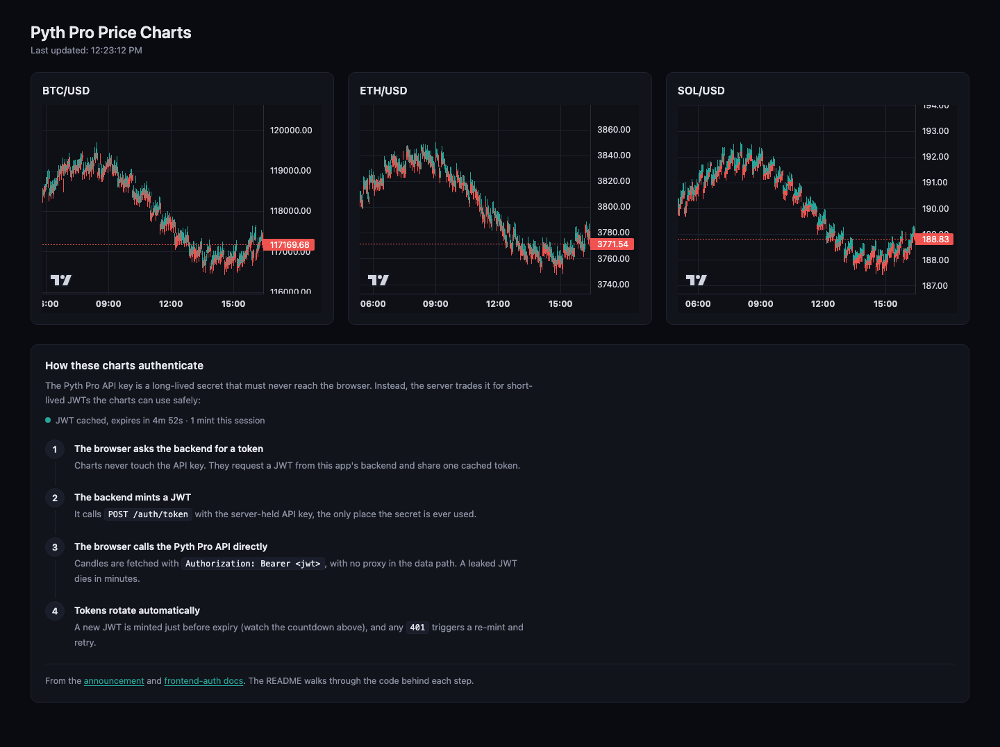
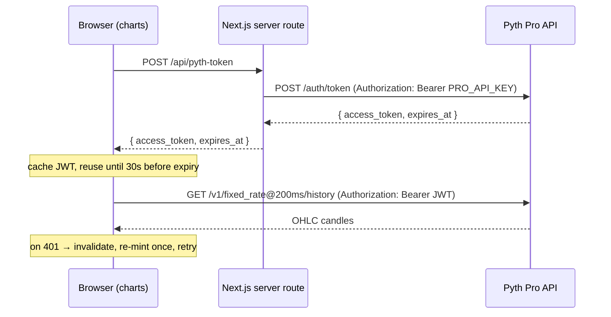

# Tutorial: Authenticating a Frontend Against the Pyth Pro API with JWTs

This example is a minimal [Next.js](https://nextjs.org/) app that renders live
BTC/USD, ETH/USD, and SOL/USD candlestick charts from the
[Pyth Pro History API](https://docs.pyth.network/price-feeds/pro/api/history),
and more importantly shows the **right way to authenticate a browser app**
against it. Every History API request must carry a JWT
([announcement](https://dev-forum.pyth.network/t/action-required-pyth-pro-history-api-auth-required-starting-july-24/808/2)),
and the JWT is minted with your long-lived Pro API key, which must **never**
ship to the browser.



The finished app also renders a "How these charts authenticate" panel at the
bottom of the page with a live view of the token cache (expiry countdown,
mints this session), so you can watch the flow described below actually happen.

## The problem this solves

A naive frontend would call the History API with
`Authorization: Bearer $PRO_API_KEY` directly. That puts your permanent API
key in the JavaScript bundle where anyone can extract it. The
[frontend-auth flow](https://docs.pyth.network/price-feeds/pro/frontend-auth)
fixes this with a token exchange:

1. Your **server** holds the API key and trades it for a **short-lived JWT**.
2. Your **browser** code caches that JWT and uses it for API calls.
3. When the JWT is about to expire, the browser asks your server for a new one.

The browser only ever holds a token that expires in minutes; the key that can
mint tokens never leaves your server.

## Architecture



Only the **mint** step goes through your server. History requests go straight
from the browser to the Pyth Pro API; your server never proxies price data.

## Quick start

Prerequisites: Node.js 18+, [pnpm](https://pnpm.io/) 9+, and a Pyth Pro API
key ([contact Pyth](https://docs.pyth.network/price-feeds/pro)).

```bash
cd pro/frontend-jwt-auth
cp .env.example .env.local          # then edit .env.local and set PRO_API_KEY
pnpm install
pnpm dev
```

Open <http://localhost:3000>. You should see three charts with the last 24
hours of 1-minute candles, refreshing every 30 seconds.

## Walkthrough

The whole flow lives in four small files. Read them in this order.

### Step 1: The server-only mint route

[`src/app/api/pyth-token/route.ts`](src/app/api/pyth-token/route.ts) is the
only place `PRO_API_KEY` is read. It forwards `POST /api/pyth-token` to the
Pyth Pro token endpoint:

```ts
const upstream = await fetch(`${baseUrl}/auth/token`, {
  method: "POST",
  headers: {
    Authorization: `Bearer ${apiKey}`, // server-held PRO_API_KEY
    "Content-Type": "application/json",
  },
  body: JSON.stringify(upstreamBody),
  cache: "no-store",
});
```

Because this file is an App Router **route handler**, it runs exclusively on
the server. The key is read from `process.env.PRO_API_KEY`, never from a
`NEXT_PUBLIC_*` variable, which Next.js would inline into the browser bundle.
On upstream errors the route mirrors the status and body back to the caller,
which makes debugging (wrong key, revoked key) much easier during development.

### Step 2: The browser token cache

[`src/lib/pythToken.ts`](src/lib/pythToken.ts) wraps the mint route in a tiny
module-level cache:

```ts
export async function getPythToken(): Promise<string> {
  if (cached && isFresh(cached)) {
    return cached.access_token;
  }
  if (!inflight) {
    inflight = mintToken().finally(() => {
      inflight = undefined;
    });
  }
  const token = await inflight;
  return token.access_token;
}
```

Two details matter here:

- **Safety margin.** `isFresh` treats a token as stale 30 seconds _before_
  `expires_at`, so a request never leaves the browser with a token that
  expires mid-flight.
- **In-flight dedup.** Three charts mount at once and all ask for a token.
  Without the shared `inflight` promise each would mint its own JWT: three
  upstream calls with your API key for no benefit. With it, one mint serves
  all concurrent callers.

### Step 3: Calling the History API from the browser

[`src/lib/pythClient.ts`](src/lib/pythClient.ts) attaches the JWT as a bearer
token on every history request:

```ts
const url = new URL(`${PYTH_API_BASE_URL}/v1/${channel}/history`);
url.searchParams.set("symbol", symbol);
url.searchParams.set("from", String(from));
url.searchParams.set("to", String(to));
url.searchParams.set("resolution", resolution);
return fetch(url.toString(), {
  headers: { Authorization: `Bearer ${token}` }, // short-lived JWT, not the API key
});
```

It also handles expiry-in-flight:

```ts
let token = await getPythToken();
let response = await fetchHistoryOnce(options, token);

if (response.status === 401) {
  invalidatePythToken(); // token expired or was revoked
  token = await getPythToken(); // forces a fresh mint
  response = await fetchHistoryOnce(options, token);
}
```

The `401` retry is the safety net for anything the safety margin can't catch:
a revoked token, a clock skew, a laptop waking from sleep. Invalidate, re-mint
once, retry once. If it still fails, surface the error.

### Step 4: Rendering and refreshing the charts

[`src/components/PythChart.tsx`](src/components/PythChart.tsx) draws the data
with [`lightweight-charts`](https://tradingview.github.io/lightweight-charts/):

- On mount it loads the last 24 hours at 1-minute resolution and calls
  `series.setData(...)`.
- Every 30 seconds it fetches just the last two minutes and applies them with
  `series.update(...)`. One quirk to know: `series.update` only accepts the
  chart's **last bar or newer**; passing an older bar throws
  `Cannot update oldest data`. The component tracks the newest applied bar
  time and skips anything older.

### Watching it work

The page's bottom panel (`src/components/AuthFlowPanel.tsx`) polls the token
cache once a second and shows the current JWT's expiry countdown and how many
mints have happened this session. Leave the page open for ~5 minutes and you
can watch the countdown hit the 30-second safety margin and a new mint occur.
The charts never notice.

## Gotcha: symbol names

The docs list symbols like `BTC/USD`, but the live `/v1/symbols` catalog
exposes crypto spot feeds under fully-qualified names like `Crypto.BTC/USD`;
the bare form returns `HTTP 404 symbol not found`. This example uses
`Crypto.{BTC,ETH,SOL}/USD` in API calls and shows the short form as the card
label. If a symbol 404s for you, check the catalog:

```bash
curl -s "https://pyth.dourolabs.app/v1/symbols" \
  -H "Authorization: Bearer $JWT" | jq -r '.[].symbol' | grep BTC
```

## Security notes

- `PRO_API_KEY` is read from `process.env` in the server route only. It is
  never referenced from a `NEXT_PUBLIC_*` variable and never imported from a
  client-side file, so it is not included in the browser bundle. You can
  verify: `pnpm build && grep -rn PRO_API_KEY .next/static` → no matches.
- The mint route in this example has **no request auth or rate limit**.
  Anyone who can reach `/api/pyth-token` can mint a JWT with your key.
  **Before running this in production, add authentication (e.g. a session
  cookie check) and a rate limit to `/api/pyth-token`.**
- The mint route mirrors the upstream error body verbatim for easier
  debugging. In production, log the upstream response server-side and return
  a generic error instead.

## Configuration

| Variable                        | Where       | Default                      | Purpose                                                    |
| ------------------------------- | ----------- | ---------------------------- | ---------------------------------------------------------- |
| `PRO_API_KEY`                   | Server only | (required)                   | Long-lived Pyth Pro API key used to mint short-lived JWTs. |
| `PYTH_API_BASE_URL`             | Server      | `https://pyth.dourolabs.app` | Override for non-prod environments.                        |
| `NEXT_PUBLIC_PYTH_API_BASE_URL` | Browser     | `https://pyth.dourolabs.app` | Override the History API base used from the browser.       |

Set the two base URL overrides together: the server mints tokens against
`PYTH_API_BASE_URL`, while the browser fetches history from
`NEXT_PUBLIC_PYTH_API_BASE_URL`. Overriding only one splits the app across
two environments.

## Scripts

- `pnpm dev`: Next.js dev server on `http://localhost:3000`
- `pnpm build`: Production build (does not require `PRO_API_KEY`)
- `pnpm start`: Serve the production build
- `pnpm test:format`: Prettier check
- `pnpm test:types`: `tsc --noEmit`

## Troubleshooting

| Symptom                                       | Cause and fix                                                                                              |
| --------------------------------------------- | ---------------------------------------------------------------------------------------------------------- |
| Charts show `Failed to mint Pyth token: 500…` | `PRO_API_KEY` is not set. Copy `.env.example` to `.env.local`, set the key, restart `pnpm dev`.            |
| Charts show a `401` invalid API key error     | The key in `.env.local` is wrong or revoked. The route mirrors the upstream body, so this is Pyth's reply. |
| Charts show a `404` symbol not found error    | Use fully-qualified symbols (`Crypto.BTC/USD`), see [Gotcha: symbol names](#gotcha-symbol-names).          |
| Token env changes not picked up               | Next.js reads `.env.local` at startup, so restart `pnpm dev` after editing it.                             |

## References

- [Pyth Pro frontend auth](https://docs.pyth.network/price-feeds/pro/frontend-auth) (primary reference for the JWT flow)
- [Pyth Pro History API](https://docs.pyth.network/price-feeds/pro/api/history)
- [Auth-required announcement](https://dev-forum.pyth.network/t/action-required-pyth-pro-history-api-auth-required-starting-july-24/808/2)
